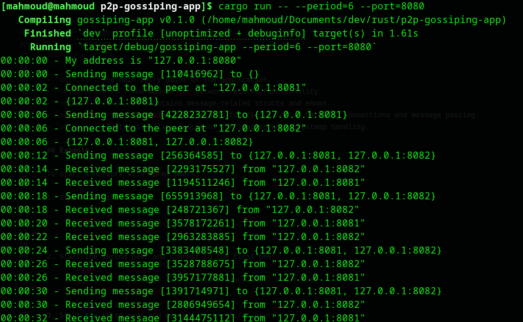
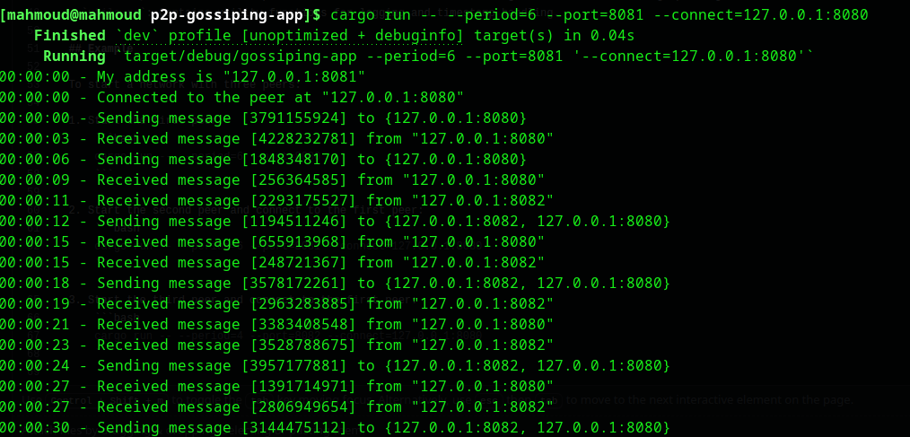
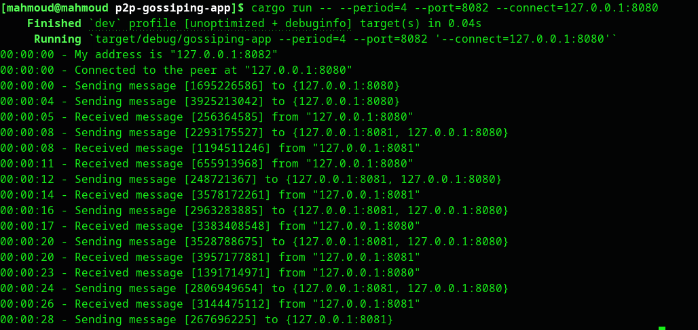

# P2P Gossiping App

[](LICENSE)
A peer to peer network implementation in Rust, to send random messages to peers in the network in the specifiec pre-defined time periods.

## Features

- Establishes P2P connections and shares peer information.
- Sends random messages to connected peers at specified intervals.
- Logs sent and received messages with timestamps indicating the time elapsed since the start of the program.

## Prerequisites
 Rust and Cargo installed. You can install Rust by following the instructions at [rust-lang.org](https://www.rust-lang.org/tools/install).

## Usage

1. Clone the repository:
    ```bash
    git clone <repository-url>
    cd p2p-network
    ```

2. Build the project:
    ```bash
    cargo build --release
    ```

3. Run a peer:
    ```bash
    cargo run -- --period=<SECONDS> --port=<PORT> [--connect=<ADDRESS>]
    ```

    - `--period <SECONDS>`: The period in seconds at which to send random messages.
    - `--port <PORT>`: The port number on which the peer listens.
    - `--connect <ADDRESS>` (optional): The address of another peer to connect to at startup (e.g., `127.0.0.1:8080`).

## Project Structure
```
src
├── main.rs
├── network
│   ├── mod.rs
│   ├── message.rs
│   └── peer.rs
└── utils.rs
```
- `main.rs`: The main entry point of the application.
- `network/mod.rs`: The module for network-related functionality.
- `network/message.rs`: Contains message-related structs and enums.
- `network/peer.rs`: Contains peer-related functions such as handling connections and message passing.
- `utils.rs`: Contains utility functions for logging and timestamp handling.

## Example

To start a network with three peers:

1. Start the first peer:
    ```bash
    cargo run -- --period=6 --port=8080
    ```


2. Start the second peer and connect to the first peer:
    ```bash
    cargo run -- --period=6 --port=8081 --connect=127.0.0.1:8080
    ```


3. Start the third peer and connect to the first peer:
    ```bash
    cargo run -- --period=4 --port=8082 --connect=127.0.0.1:8080
    ```

